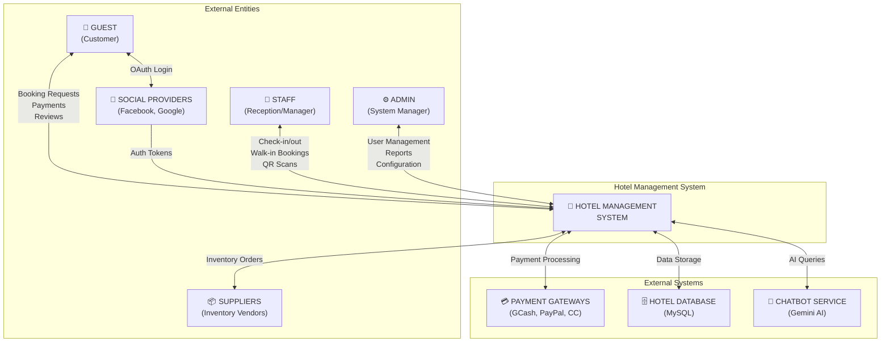

# Level 0 DFD Context Diagram - Bayawan Bai Hotel Management System

## System Name: Hotel Management System (HMS)



---

## ASCII Art Alternative (Legacy)

<details>
<summary>View ASCII Version</summary>

```
┌─────────────────────────────────────────────────────────────────────────────────────────────────────┐
│                                                                                                     │
│   ┌──────────────┐     ┌─────────────────────────────────────────────────────────┐     ┌──────────┐ │
│   │              │     │                                                         │     │          │ │
│   │    GUEST     │◄───►│                                                         │◄───►│  ADMIN   │ │
│   │  (Customer)  │     │                                                         │     │          │ │
│   └──────────────┘     │                                                         │     └──────────┘ │
│           ▲            │                                                         │           ▲      │
│           │            │         ┌─────────────────────────┐                   │           │      │
│   ┌───────┴──────┐     │         │                         │                   │     ┌───────┴────┐ │
│   │              │     │         │   HOTEL MANAGEMENT      │                   │     │            │ │
│   │  SOCIAL      │◄───┼────────►│       SYSTEM            │◄──────────────────┼────►│   STAFF    │ │
│   │  PROVIDERS   │     │         │     (PROCESS 0)         │                   │     │(Reception/ │ │
│   │(Facebook,    │     │         │                         │                   │     │ Manager)   │ │
│   │  Google)     │     │         └─────────────────────────┘                   │     └────────────┘ │
│   └──────────────┘     │                      ▲    ▲    ▲                       │                    │
│                        │                      │    │    │                       │                    │
│                        │         ┌───────────┘    │    └───────────┐           │                    │
│                        │         │                │                │           │                    │
│   ┌──────────────┐     │    ┌────┴────┐      ┌────┴────┐      ┌────┴────┐      │                    │
│   │              │     │    │         │      │         │      │         │      │                    │
│   │  SUPPLIERS   │◄────┼───►│  PAYMENT│      │  HOTEL  │      │ CHATBOT │      │                    │
│   │ (Inventory)  │     │    │ GATEWAYS│      │ DATABASE│      │ SERVICE │      │                    │
│   └──────────────┘     │    └─────────┘      └─────────┘      └─────────┘      │                    │
│                        │    (GCash, PayPal)                                          │                    │
│                        └─────────────────────────────────────────────────────────┘                    │
│                                                                                                     │
└─────────────────────────────────────────────────────────────────────────────────────────────────────┘
```
</details>

---

## Legend:

| Symbol | Description |
|--------|-------------|
| ▭ (Rectangle) | External Entity |
| ◯ (Circle) | Process |
| ≡ (Open Rectangle) | Data Store |
| → (Arrow) | Data Flow |

---

## External Entities

1. **Guest (Customer)** - End users who browse rooms, make bookings, order food, book events, submit reviews
2. **Staff (Receptionist/Manager)** - Hotel staff managing day-to-day operations, check-ins, check-outs
3. **Administrator** - System administrators managing users, settings, reports, and system configuration
4. **Social Providers** - External authentication services (Facebook, Google) for OAuth login
5. **Payment Gateways** - External payment processors (GCash, PayPal, Credit Card)
6. **Suppliers** - Vendors providing inventory items (linens, toiletries, food supplies)
7. **Chatbot Service** - AI-powered customer service (Gemini API)

---

## Data Flows

### 1. Guest ↔ Hotel Management System
**To System:**
- Guest Registration/Login credentials
- Room Booking Requests (dates, room type, guests)
- Event Booking Requests (space, date, catering)
- Food Orders (room service, dine-in)
- Payment Information
- Review & Rating Submissions
- Contact/Feedback Messages

**From System:**
- Booking Confirmations
- Payment Receipts
- Room Availability Info
- Order Status Updates
- Virtual Tour Access
- Notifications/Alerts

---

### 2. Staff ↔ Hotel Management System
**To System:**
- Login Credentials
- Check-in/Check-out Actions
- Booking Confirmations
- Walk-in Booking Data
- Maintenance Requests
- Room Status Updates
- QR Code Scans

**From System:**
- Booking Lists & Details
- Room Occupancy Status
- Guest Information
- Calendar/Schedule
- Task Notifications
- QR Verification Results

---

### 3. Admin ↔ Hotel Management System
**To System:**
- User Management Commands
- Room/Event Configuration
- Promotion/Pricing Updates
- Inventory Management
- System Settings
- Permission Changes

**From System:**
- Analytics & Reports
- User Activity Logs
- Financial Reports
- System Status
- Notification Logs

---

### 4. Social Providers ↔ Hotel Management System
**To System:** OAuth authentication tokens, user profile data
**From System:** Authentication requests

---

### 5. Payment Gateways ↔ Hotel Management System
**To System:** Payment confirmation, transaction IDs, failure notifications
**From System:** Payment requests, amount, method

---

### 6. Suppliers ↔ Hotel Management System (implied)
**To System:** Inventory delivery confirmations
**From System:** Reorder notifications

---

## Data Stores

1. **Hotel Database (D1)** - MySQL database containing:
   - Users table (guests, staff, admin)
   - Room Categories & Rooms tables
   - Bookings & Event Bookings tables
   - Payments table
   - Menu Items & Food Orders tables
   - Inventory tables
   - Reviews & Ratings tables
   - Settings & Logs tables

---

## Context Diagram Explanation

The **Level 0 DFD (Context Diagram)** shows the **Hotel Management System** as a single central process (Process 0) that interacts with external entities. It represents the **highest level of abstraction**, showing:

- **Who** interacts with the system (external entities)
- **What** data flows in and out
- **Where** data is stored

The system acts as a bridge between guests, staff, and administrators while integrating with external services like payment gateways and social login providers.

---

## Alternative Visual Representation (Text Format)

```
                              ┌─────────────────────────┐
                              │      GUEST/CUSTOMER     │
                              │    (External Entity)    │
                              └───────────┬─────────────┘
                                          │
    ┌───────────────────┐                 │                 ┌───────────────────┐
    │  SOCIAL PROVIDERS │◄────────────────┼────────────────►│  PAYMENT GATEWAYS │
    │ (Facebook,Google) │                 │                 │ (GCash,PayPal,CC) │
    └───────────────────┘                 │                 └───────────────────┘
                                          │
                                          ▼
┌───────────────────────────────────────────────────────────────────────────────────┐
│                                                                                   │
│                    ┌───────────────────────────────────┐                           │
│                    │                                   │                           │
│    ┌───────────────┤      HOTEL MANAGEMENT SYSTEM    ├───────────────────┐        │
│    │               │           (Process 0)           │                   │        │
│    │               │                                   │                   │        │
│    │               └───────────────┬─────────────────┘                   │        │
│    │                               │                                     │        │
│    │                               ▼                                     │        │
│    │               ┌───────────────────────────────────┐                 │        │
│    │               │         HOTEL DATABASE            │                 │        │
│    │               │        (Central Data Store)       │                 │        │
│    │               └───────────────────────────────────┘                 │        │
│    │                                                                   │        │
│  ┌─┴──────────┐                                              ┌────────┴──┐     │
│  │   STAFF    │                                              │   ADMIN   │     │
│  │(Reception/│                                              │(System   │     │
│  │ Manager)   │                                              │ Manager)  │     │
│  └────────────┘                                              └───────────┘     │
│                                                                                   │
└───────────────────────────────────────────────────────────────────────────────────┘
```
