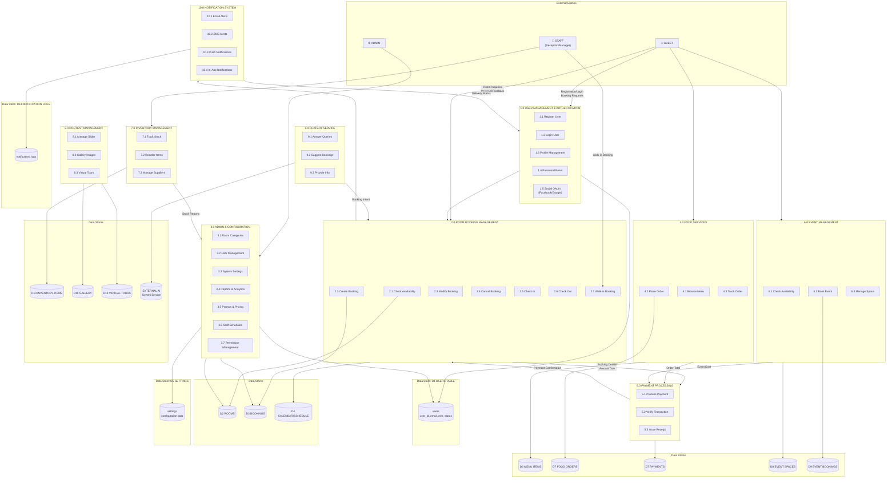

# Level 1 DFD - Process Decomposition
## Bayawan Bai Hotel Management System



---

## ASCII Art Alternative (Legacy)

<details>
<summary>View Original ASCII Version</summary>

```
[Original ASCII diagram preserved here...]
```
</details>

---

## Process Descriptions

### **1.0 USER MANAGEMENT & AUTHENTICATION**
Handles all user-related operations including registration, login, profile management, and password resets.
- **Inputs:** Registration data, login credentials, OAuth tokens
- **Outputs:** User sessions, authentication tokens, profile data
- **Data Stores:** D1 Users Table

### **2.0 ROOM BOOKING MANAGEMENT**
Core booking system handling room availability checks, reservations, modifications, and check-in/check-out.
- **2.1 Check Availability** - Queries room availability for date ranges
- **2.2 Create Booking** - Processes new reservations
- **2.3 Modify Booking** - Handles changes to existing bookings
- **2.4 Cancel Booking** - Processes cancellations and refunds
- **2.5 Check In** - Guest arrival processing
- **2.6 Check Out** - Departure processing and billing
- **2.7 Walk-in Booking** - Direct desk bookings by staff
- **Data Stores:** D2 Rooms, D3 Bookings, D4 Calendar/Schedule

### **3.0 ADMIN & CONFIGURATION**
Administrative functions for system management.
- **3.1 Room Categories Management** - Define room types, pricing, amenities
- **3.2 User Management** - CRUD operations on users
- **3.3 System Settings** - Global configuration
- **3.4 Reports & Analytics** - Generate business reports
- **3.5 Promotions & Pricing** - Special offers and dynamic pricing
- **3.6 Staff Schedules** - Work shift management
- **3.7 Permission Management** - Role-based access control
- **Data Stores:** D5 Settings, D1 Users, D2 Rooms

### **4.0 FOOD SERVICES**
Restaurant and room service ordering system.
- **4.1 Browse Menu** - Display food items and categories
- **4.2 Place Order** - Submit food orders
- **4.3 Track Order** - Order status tracking
- **Data Stores:** D6 Menu Items, D7 Food Orders

### **5.0 PAYMENT PROCESSING**
Handles all financial transactions.
- **5.1 Process Payment** - Charge processing via GCash, PayPal, Credit Card
- **5.2 Verify Transaction** - Payment confirmation and fraud checks
- **5.3 Issue Receipt** - Generate payment confirmations
- **External:** Payment Gateways (GCash, PayPal, Stripe)
- **Data Store:** D7 Payments

### **6.0 EVENT MANAGEMENT**
Event space booking and management.
- **6.1 Check Availability** - Venue availability queries
- **6.2 Book Event** - Event reservation processing
- **6.3 Manage Space** - Venue configuration
- **Data Stores:** D8 Event Spaces, D9 Event Bookings

### **7.0 INVENTORY MANAGEMENT**
Hotel supplies and stock management.
- **7.1 Track Stock** - Inventory level monitoring
- **7.2 Reorder Items** - Purchase order generation
- **7.3 Manage Suppliers** - Vendor relationships
- **Data Store:** D10 Inventory Items

### **8.0 CONTENT MANAGEMENT**
Website content and media management.
- **8.1 Manage Slider** - Homepage banner content
- **8.2 Gallery Images** - Photo management
- **8.3 Virtual Tours** - 360° tour management
- **Data Stores:** D11 Gallery, D12 Virtual Tours

### **9.0 CHATBOT SERVICE**
AI-powered customer service automation.
- **9.1 Answer Queries** - FAQ and information responses
- **9.2 Suggest Bookings** - Room recommendations
- **9.3 Provide Info** - General hotel information
- **External:** Gemini AI Service

### **10.0 NOTIFICATION SYSTEM**
Multi-channel communication system.
- **10.1 Email Alerts** - Booking confirmations, promotions
- **10.2 SMS Alerts** - Payment confirmations, reminders
- **10.3 Push Notifications** - Mobile app alerts
- **10.4 In-App Notifications** - Dashboard alerts
- **Data Store:** D13 Notification Logs

---

## Data Store Definitions

| ID | Name | Description | Key Entities |
|----|------|-------------|--------------|
| **D1** | Users Table | Guest, staff, and admin accounts | user_id, email, role, status |
| **D2** | Rooms | Room inventory and status | room_id, category_id, status |
| **D3** | Bookings | Reservation records | booking_id, user_id, dates, status |
| **D4** | Calendar/Schedule | Availability and scheduling data | dates, room assignments |
| **D5** | Settings Table | System configuration | setting_key, setting_value |
| **D6** | Menu Items | Food and beverage catalog | item_id, name, price, category |
| **D7** | Food Orders | Order transactions | order_id, user_id, items, status |
| **D7** | Payments | Financial transactions | payment_id, booking_id, amount, method |
| **D8** | Event Spaces | Venue inventory | space_id, name, capacity, price |
| **D9** | Event Bookings | Event reservations | event_booking_id, space_id, date |
| **D10** | Inventory Items | Supply stock | item_id, quantity, reorder_level |
| **D11** | Gallery | Media content | image_id, path, category |
| **D12** | Virtual Tours | 360° tour data | tour_id, hotspots, images |
| **D13** | Notification Logs | Communication history | log_id, user_id, type, status |

---

## Data Flow Matrix

| From Process | To Process | Data Flow Description |
|--------------|------------|----------------------|
| 1.0 (User Mgmt) | 2.0 (Booking) | Validated user_id |
| 2.0 (Booking) | 5.0 (Payment) | Booking details, amount due |
| 5.0 (Payment) | 2.0 (Booking) | Payment confirmation, status |
| 2.0 (Booking) | 10.0 (Notification) | Trigger events (confirm, reminder) |
| 4.0 (Food) | 5.0 (Payment) | Order total, payment request |
| 6.0 (Event) | 5.0 (Payment) | Event cost, payment request |
| 3.0 (Admin) | 2.0 (Booking) | Configuration updates |
| 9.0 (Chatbot) | 2.0 (Booking) | Booking intent, user queries |
| 7.0 (Inventory) | 3.0 (Admin) | Stock reports, alerts |
| 10.0 (Notification) | 1.0 (User Mgmt) | Delivery status |

---

## Key Processes to Level 2 DFD

For more detailed analysis, the following processes can be decomposed further:
- **2.0 Room Booking Management** → Individual booking lifecycle states
- **5.0 Payment Processing** → Gateway-specific flows
- **3.0 Admin & Configuration** → Each admin function as separate process
