# Bayawan Bai Hotel - Entity Relationship Diagram

## Core Tables

```mermaid
erDiagram
    direction TB
    %% ==================== CORE TABLES ====================
    
    USERS {
        int user_id PK
        varchar email UK
        varchar password
        varchar first_name
        varchar last_name
        varchar phone
        text address
        varchar city
        varchar country
        enum role
        enum status
        boolean email_verified
        int loyalty_points
        date member_since
        timestamp created_at
        timestamp updated_at
        timestamp last_login
        boolean active_status
    }
    
    ROOM_CATEGORIES {
        int category_id PK
        varchar category_name
        text description
        decimal base_price
        int max_occupancy
        varchar bed_type
        int room_size_sqm
        text amenities
        varchar image_primary
        text images_gallery
        enum status
        timestamp created_at
    }
    
    ROOMS {
        int room_id PK
        varchar room_number UK
        int category_id FK
        int floor
        enum status
        enum housekeeping_status
        text special_features
        timestamp created_at
    }
    
    BOOKINGS {
        int booking_id PK
        varchar booking_ref UK
        int user_id FK
        int room_id FK
        int category_id FK
        date check_in
        date check_out
        int adults
        int children
        int nights
        decimal room_rate
        decimal total_amount
        enum status
        enum payment_status
        enum payment_method
        text special_requests
        enum booking_source
        timestamp created_at
        timestamp updated_at
        timestamp checked_in_at
        timestamp checked_out_at
    }
    
    PAYMENTS {
        int payment_id PK
        int booking_id FK
        int user_id FK
        decimal amount
        enum payment_method
        varchar transaction_id
        enum status
        timestamp payment_date
        text notes
    }
    
    BOOKING_CHARGES {
        int charge_id PK
        int booking_id FK
        varchar description
        decimal amount
        enum charge_type
        enum status
        timestamp created_at
        int created_by FK
    }
    
    %% ==================== HOTEL SERVICES ====================
    
    MENU_CATEGORIES {
        int cat_id PK
        varchar category_name
        text description
        int sort_order
    }
    
    MENU_ITEMS {
        int item_id PK
        int cat_id FK
        varchar item_name
        text description
        decimal price
        varchar image
        boolean is_special
        boolean is_available
        text dietary_info
    }
    
    FOODS {
        int food_id PK
        int category_id FK
        varchar food_name
        text description
        decimal price
        varchar image
        boolean is_special
        boolean is_available
        varchar dietary_info
        int prep_time_minutes
        int stock_quantity
        decimal cost_price
        timestamp created_at
        timestamp updated_at
    }
    
    FOOD_ORDERS {
        int order_id PK
        int user_id FK
        int booking_id FK
        int food_id FK
        int quantity
        decimal unit_price
        decimal total_price
        enum status
        enum order_type
        enum payment_method
        enum payment_status
        varchar room_number
        text special_instructions
        timestamp created_at
        timestamp updated_at
        timestamp prepared_at
        timestamp delivered_at
    }
    
    AMENITIES {
        int amenity_id PK
        varchar amenity_name
        enum category
        text description
        decimal price
        int duration_minutes
        varchar image
        boolean is_available
        varchar operating_hours
    }
    
    EVENT_SPACES {
        int space_id PK
        varchar space_name
        text description
        int capacity
        int area_sqm
        text features
        decimal price_per_day
        varchar image_primary
        text images
        enum status
    }
    
    EVENT_BOOKINGS {
        int event_booking_id PK
        int user_id FK
        int space_id FK
        varchar event_type
        date event_date
        time start_time
        time end_time
        int guests_count
        boolean catering_required
        text special_requests
        enum status
        decimal quoted_price
        varchar inquiry_name
        varchar inquiry_email
        varchar inquiry_phone
        timestamp created_at
    }
    
    EVENTS {
        int event_id PK
        varchar event_name
        int category_id FK
        int floor
        enum status
        enum maintenance_status
        text special_features
        timestamp created_at
    }
    
    %% ==================== CONTENT MANAGEMENT ====================
    
    GALLERY {
        int image_id PK
        varchar title
        text description
        varchar image_path
        enum category
        boolean is_featured
        int sort_order
        timestamp uploaded_at
    }
    
    HOMEPAGE_SLIDER {
        int slide_id PK
        varchar title
        text subtitle
        varchar image
        varchar button_text
        varchar button_link
        int sort_order
        boolean is_active
    }
    
    PROMOTIONS {
        int promo_id PK
        varchar title
        text description
        varchar image
        int discount_percent
        decimal discount_amount
        varchar promo_code
        date start_date
        date end_date
        int min_nights
        boolean is_active
        timestamp created_at
    }
    
    FAQS {
        int faq_id PK
        text question
        text answer
        varchar category
        int sort_order
        boolean is_active
    }
    
    %% ==================== STAFF & OPERATIONS ====================
    
    STAFF_SCHEDULES {
        int schedule_id PK
        int user_id FK
        date work_date
        time shift_start
        time shift_end
        varchar role
        enum status
        text notes
    }
    
    MAINTENANCE_REQUESTS {
        int request_id PK
        int room_id FK
        int reported_by FK
        enum issue_type
        text description
        enum priority
        enum status
        timestamp created_at
        timestamp resolved_at
    }
    
    INVENTORY_CATEGORIES {
        int inv_cat_id PK
        varchar category_name
    }
    
    INVENTORY_ITEMS {
        int item_id PK
        int inv_cat_id FK
        varchar item_name
        text description
        varchar unit
        int quantity
        int reorder_level
        decimal unit_cost
        varchar supplier
    }
    
    %% ==================== RATINGS & REVIEWS ====================
    
    REVIEWS {
        int review_id PK
        int user_id FK
        int booking_id FK
        int rating
        text review_text
        enum category
        boolean is_approved
        boolean is_featured
        timestamp created_at
        timestamp updated_at
    }
    
    RATINGS {
        int rating_id PK
        int user_id FK
        enum service_type
        int booking_id FK
        int event_booking_id FK
        int food_order_id FK
        tinyint rating_value
        text comment
        boolean is_rated
        timestamp created_at
        timestamp updated_at
    }
    
    RATING_ELIGIBILITY {
        int eligibility_id PK
        int user_id FK
        enum service_type
        int booking_id
        int event_booking_id
        int food_order_id
        varchar status
        timestamp eligible_at
        timestamp shown_at
        timestamp completed_at
        timestamp created_at
    }
    
    %% ==================== SYSTEM TABLES ====================
    
    SETTINGS {
        int setting_id PK
        varchar setting_key UK
        text setting_value
        varchar setting_group
    }
    
    NOTIFICATION_LOGS {
        int log_id PK
        int user_id FK
        enum type
        varchar subject
        text content
        enum status
        timestamp sent_at
        text error_message
    }
    
    USER_SESSIONS {
        varchar session_id PK
        int user_id FK
        varchar ip_address
        text user_agent
        timestamp created_at
        timestamp expires_at
    }
    
    BOOKING_LOGS {
        int log_id PK
        int booking_id FK
        varchar action
        text details
        int created_by FK
        timestamp created_at
    }
    
    ACTIVITY_LOGS {
        int log_id PK
        int user_id FK
        varchar action
        text details
        varchar ip_address
        text user_agent
        timestamp created_at
    }
    
    STAFF_PERMISSIONS {
        int permission_id PK
        int user_id FK
        varchar page_name
        boolean can_access
        timestamp created_at
        timestamp updated_at
    }
    
    STAFF_PERMISSION_SETTINGS {
        int setting_id PK
        varchar setting_name UK
        text setting_value
        timestamp created_at
        timestamp updated_at
    }
    
    NOTIFICATIONS {
        int notification_id PK
        int user_id FK
        enum type
        varchar title
        text message
        int related_id
        varchar related_type
        enum status
        enum priority
        varchar action_url
        timestamp created_at
        timestamp read_at
    }
    
    NOTIFICATION_SETTINGS {
        int setting_id PK
        int user_id FK
        enum notification_type
        boolean email_enabled
        boolean popup_enabled
        timestamp created_at
        timestamp updated_at
    }
    
    %% ==================== CHATBOT TABLES ====================
    
    CHAT_SESSIONS {
        int session_id PK
        int user_id FK
        varchar session_token UK
        enum status
        timestamp created_at
        timestamp updated_at
        timestamp last_message_at
    }
    
    CHAT_MESSAGES {
        int message_id PK
        int session_id FK
        int user_id FK
        enum message_type
        text message
        varchar intent
        json metadata
        boolean is_read
        timestamp created_at
    }
    
    CHATBOT_KNOWLEDGE {
        int knowledge_id PK
        varchar category
        varchar question_pattern
        text answer
        text keywords
        int priority
        boolean is_active
        timestamp created_at
        timestamp updated_at
    }
    
    CHATBOT_CONTEXT {
        int context_id PK
        int user_id FK
        varchar context_key
        text context_value
        timestamp created_at
        timestamp updated_at
    }
    
    %% ==================== VIRTUAL TOUR TABLES ====================
    
    ROOM_VIRTUAL_TOURS {
        int tour_id PK
        int category_id FK
        varchar panorama_image
        varchar thumbnail_image
        varchar title
        text description
        json hotspot_config
        boolean is_active
        int display_order
        timestamp created_at
        timestamp updated_at
    }
    
    VIRTUAL_TOUR_HOTSPOTS {
        int hotspot_id PK
        int tour_id FK
        enum hotspot_type
        decimal pitch
        decimal yaw
        varchar text
        int target_tour_id FK
        varchar target_url
        varchar css_class
        timestamp created_at
    }
    
    EVENT_VIRTUAL_TOURS {
        int tour_id PK
        int space_id FK
        varchar panorama_image
        varchar thumbnail_image
        varchar title
        text description
        json hotspot_config
        boolean is_active
        int display_order
        timestamp created_at
        timestamp updated_at
    }
    
    EVENT_VIRTUAL_TOUR_HOTSPOTS {
        int hotspot_id PK
        int tour_id FK
        enum hotspot_type
        decimal pitch
        decimal yaw
        varchar text
        int target_tour_id FK
        varchar target_url
        varchar css_class
        timestamp created_at
    }
    
    %% ==================== RELATIONSHIPS ====================
    
    %% Core Booking Relationships
    USERS ||--o{ BOOKINGS : "makes"
    USERS ||--o{ PAYMENTS : "makes"
    USERS ||--o{ BOOKING_CHARGES : "creates"
    USERS ||--o{ REVIEWS : "writes"
    USERS ||--o{ RATINGS : "submits"
    
    ROOM_CATEGORIES ||--o{ ROOMS : "categorizes"
    ROOM_CATEGORIES ||--o{ BOOKINGS : "booked_as"
    ROOM_CATEGORIES ||--o{ EVENTS : "categorizes"
    ROOM_CATEGORIES ||--o{ ROOM_VIRTUAL_TOURS : "has"
    
    ROOMS ||--o{ BOOKINGS : "booked_in"
    ROOMS ||--o{ MAINTENANCE_REQUESTS : "has"
    
    BOOKINGS ||--o{ PAYMENTS : "has"
    BOOKINGS ||--o{ BOOKING_CHARGES : "has"
    BOOKINGS ||--o{ BOOKING_LOGS : "logged"
    BOOKINGS ||--o{ REVIEWS : "reviewed"
    BOOKINGS ||--o{ RATINGS : "rated"
    BOOKINGS ||--o{ FOOD_ORDERS : "has"
    
    %% Food Service Relationships
    MENU_CATEGORIES ||--o{ MENU_ITEMS : "contains"
    MENU_CATEGORIES ||--o{ FOODS : "contains"
    
    USERS ||--o{ FOOD_ORDERS : "places"
    FOOD_ORDERS ||--o{ RATINGS : "rated"
    
    %% Event Relationships
    EVENT_SPACES ||--o{ EVENT_BOOKINGS : "booked"
    EVENT_SPACES ||--o{ EVENT_VIRTUAL_TOURS : "has"
    
    USERS ||--o{ EVENT_BOOKINGS : "books"
    EVENT_BOOKINGS ||--o{ RATINGS : "rated"
    
    %% Staff & Operations
    USERS ||--o{ STAFF_SCHEDULES : "scheduled"
    USERS ||--o{ MAINTENANCE_REQUESTS : "reports"
    USERS ||--o{ BOOKING_CHARGES : "creates"
    USERS ||--o{ BOOKING_LOGS : "creates"
    USERS ||--o{ ACTIVITY_LOGS : "generates"
    USERS ||--o{ USER_SESSIONS : "has"
    USERS ||--o{ NOTIFICATION_LOGS : "receives"
    USERS ||--o{ NOTIFICATIONS : "receives"
    USERS ||--o{ NOTIFICATION_SETTINGS : "configures"
    USERS ||--o{ STAFF_PERMISSIONS : "has"
    
    INVENTORY_CATEGORIES ||--o{ INVENTORY_ITEMS : "contains"
    
    %% Chatbot Relationships
    USERS ||--o{ CHAT_SESSIONS : "starts"
    USERS ||--o{ CHAT_MESSAGES : "sends"
    USERS ||--o{ CHATBOT_CONTEXT : "stores"
    
    CHAT_SESSIONS ||--o{ CHAT_MESSAGES : "contains"
    
    %% Virtual Tour Relationships
    ROOM_VIRTUAL_TOURS ||--o{ VIRTUAL_TOUR_HOTSPOTS : "has"
    VIRTUAL_TOUR_HOTSPOTS ||--o{ VIRTUAL_TOUR_HOTSPOTS : "navigates_to"
    
    EVENT_VIRTUAL_TOURS ||--o{ EVENT_VIRTUAL_TOUR_HOTSPOTS : "has"
    EVENT_VIRTUAL_TOUR_HOTSPOTS ||--o{ EVENT_VIRTUAL_TOUR_HOTSPOTS : "navigates_to"
    
    %% Rating Eligibility
    USERS ||--o{ RATING_ELIGIBILITY : "eligible_for"
```



---

## Table Summary

### Core Tables (5 tables)
| Table | Description | Records |
|-------|-------------|---------|
| `users` | Guest, staff, and admin accounts | All users |
| `room_categories` | Room types (Standard, Deluxe, Suite, Family) | 4 categories |
| `rooms` | Individual hotel rooms | 12 rooms |
| `bookings` | Room reservations | Booking transactions |
| `payments` | Payment records | Payment history |
| `booking_charges` | Additional charges (minibar, room service, etc.) | Extra charges |

### Hotel Services Tables (8 tables)
| Table | Description |
|-------|-------------|
| `menu_categories` | Food menu categories |
| `menu_items` | Restaurant menu items |
| `foods` | Extended food items with inventory |
| `food_orders` | Room service and restaurant orders |
| `amenities` | Spa, gym, pool services |
| `event_spaces` | Venues for events/meetings |
| `event_bookings` | Event space reservations |
| `events` | Event venue rooms |

### Content Management Tables (4 tables)
| Table | Description |
|-------|-------------|
| `gallery` | Hotel photo gallery |
| `homepage_slider` | Website homepage carousel |
| `promotions` | Special offers and discounts |
| `faqs` | Frequently asked questions |

### Staff & Operations Tables (4 tables)
| Table | Description |
|-------|-------------|
| `staff_schedules` | Employee work shifts |
| `maintenance_requests` | Room maintenance tickets |
| `inventory_categories` | Inventory classification |
| `inventory_items` | Stock items and supplies |

### Ratings & Reviews Tables (3 tables)
| Table | Description |
|-------|-------------|
| `reviews` | Guest reviews for rooms/services |
| `ratings` | 1-5 star ratings for services |
| `rating_eligibility` | Tracks pending ratings |

### System Tables (7 tables)
| Table | Description |
|-------|-------------|
| `settings` | Hotel configuration |
| `notification_logs` | Email/SMS delivery logs |
| `user_sessions` | Active user sessions |
| `booking_logs` | Booking activity history |
| `activity_logs` | System activity tracking |
| `staff_permissions` | Page access permissions |
| `staff_permission_settings` | Global permission defaults |
| `notifications` | In-app notifications |
| `notification_settings` | User notification preferences |

### Chatbot Tables (4 tables)
| Table | Description |
|-------|-------------|
| `chat_sessions` | Chat conversation sessions |
| `chat_messages` | Individual chat messages |
| `chatbot_knowledge` | FAQ and response database |
| `chatbot_context` | User preference storage |

### Virtual Tour Tables (4 tables)
| Table | Description |
|-------|-------------|
| `room_virtual_tours` | 360° room panoramas |
| `virtual_tour_hotspots` | Interactive tour points |
| `event_virtual_tours` | 360° event space tours |
| `event_virtual_tour_hotspots` | Event space hotspots |

---

## Total: **35 Tables**

## Key Relationships Summary

```
users (1) ──────── (*) bookings ──────── (1) rooms
   │                    │
   │                    ├── (*) payments
   │                    ├── (*) booking_charges
   │                    ├── (*) reviews
   │                    ├── (*) ratings
   │                    └── (*) food_orders
   │
   ├── (*) event_bookings ─── (1) event_spaces
   ├── (*) chat_sessions ──── (*) chat_messages
   ├── (*) user_sessions
   ├── (*) notifications
   └── (*) activity_logs

room_categories (1) ── (*) rooms
                ├── (*) bookings
                └── (*) room_virtual_tours ── (*) virtual_tour_hotspots

menu_categories (1) ── (*) menu_items
                  └── (*) foods
```

## Generated
This ERD was generated from `database/database.sql` - Bayawan Bai Hotel Management System schema.
