# Bayawan Bai Hotel - System Architecture Design

## 1. High-Level Architecture Overview

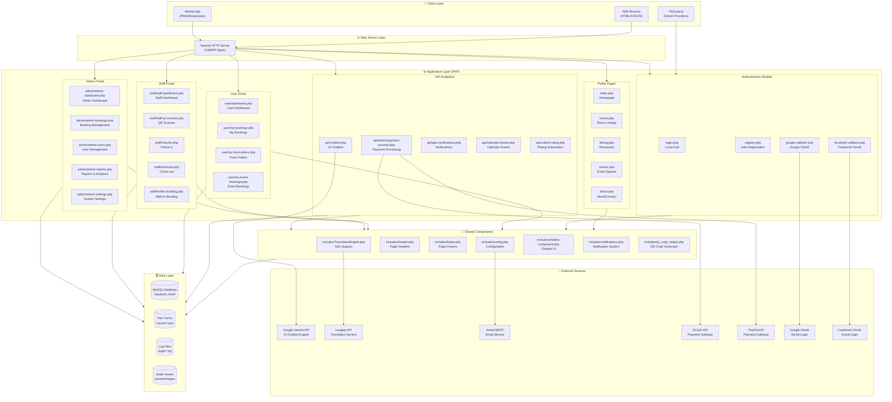

---

## 2. Technology Stack

| Layer | Technology | Purpose |
|-------|------------|---------|
| **Web Server** | Apache HTTP Server (XAMPP) | HTTP request handling |
| **Server-side** | PHP 8.x | Application logic |
| **Database** | MySQL 8.x | Data persistence (35 tables) |
| **Frontend** | HTML5, CSS3, JavaScript | UI rendering |
| **CSS Framework** | Custom + FontAwesome | Styling & icons |
| **JS Libraries** | Vanilla JS, Fetch API | Client-side interactivity |
| **Email** | PHPMailer 7.x | SMTP email sending |
| **QR Codes** | Endroid QR Code 5.x | QR generation for check-in |
| **AI/ML** | Google Gemini API | Chatbot intelligence |
| **Translation** | Langbly API | Multi-language support |
| **Payments** | GCash, PayPal APIs | Payment processing |
| **OAuth** | Google, Facebook APIs | Social authentication |

---

## 3. Application Architecture (MVC Pattern)

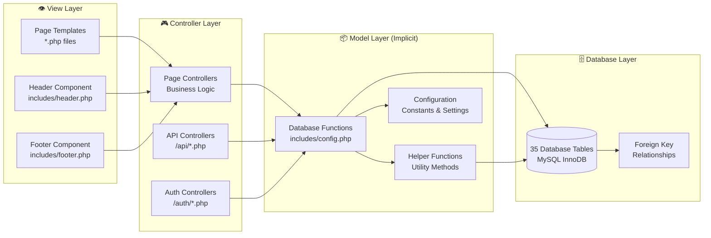

---

## 4. Authentication & Authorization Flow

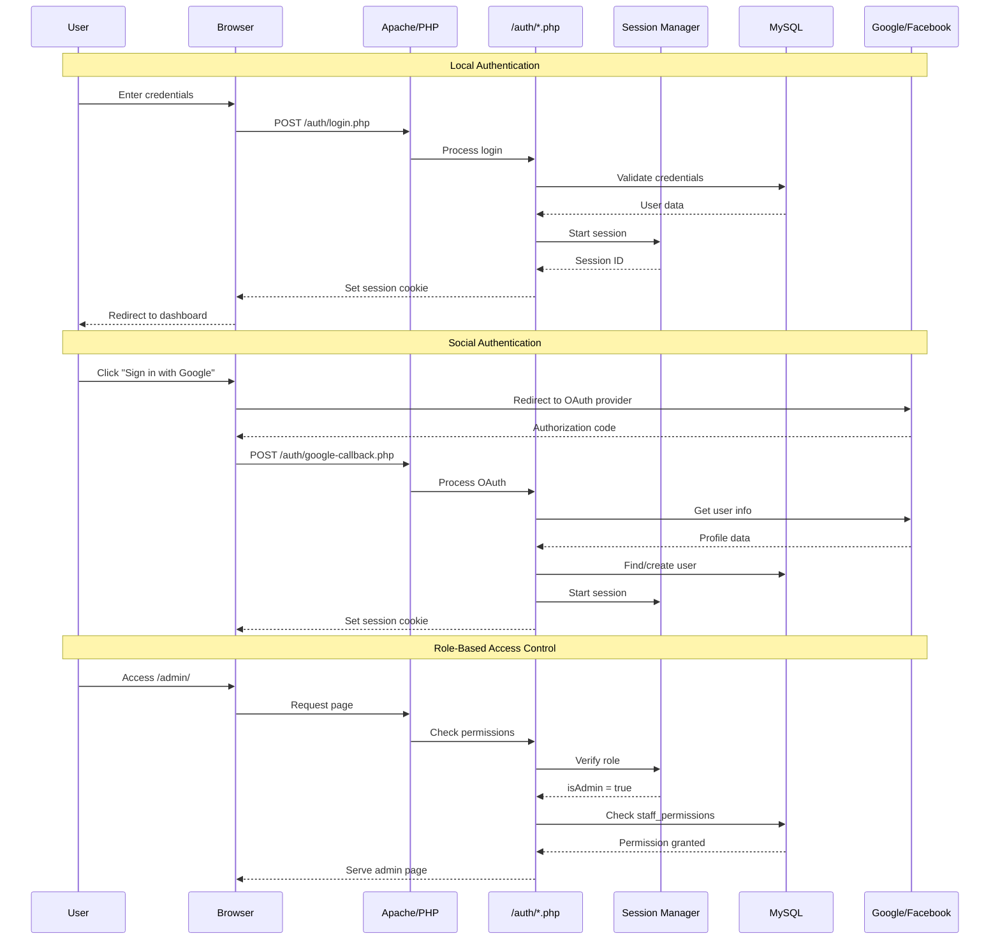

---

## 5. Database Architecture

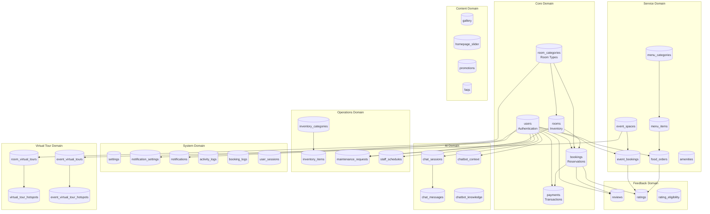

---

## 6. Chatbot Architecture (AI Integration)

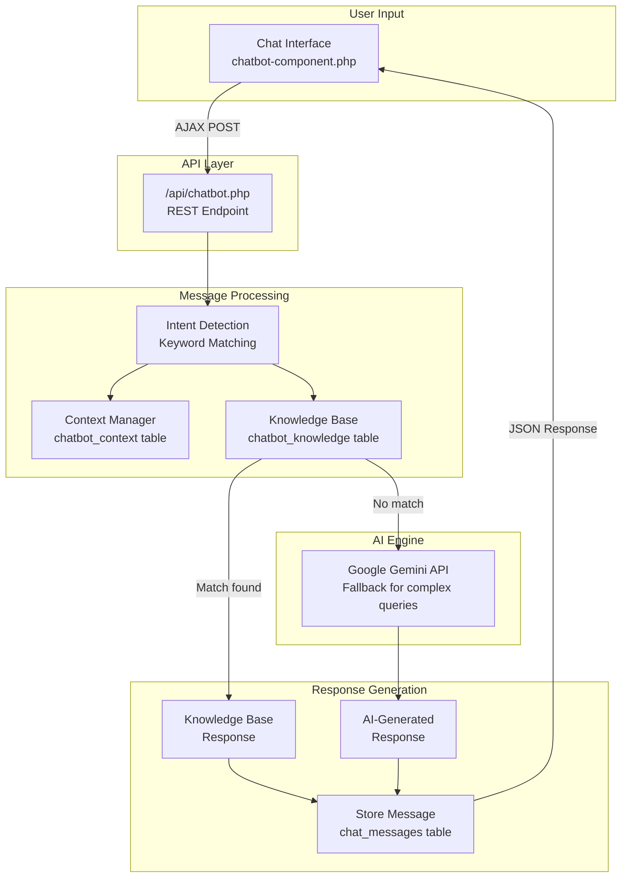

---

## 7. Payment Processing Architecture

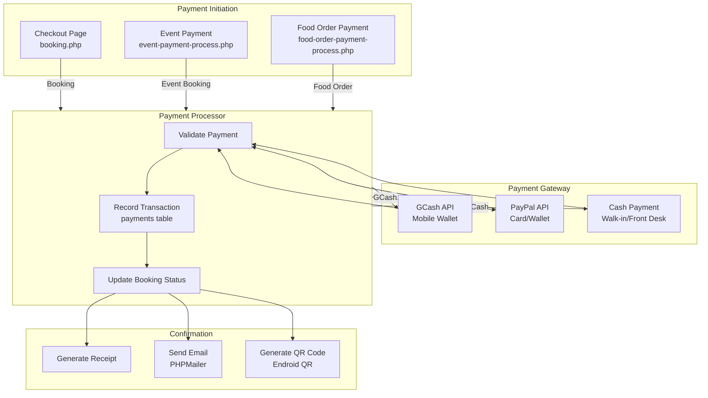

---

## 8. Notification System Architecture

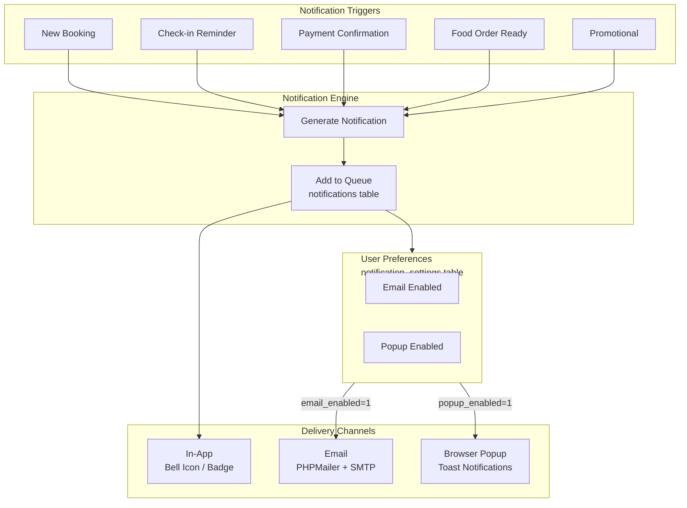

---

## 9. Multi-language (i18n) Architecture

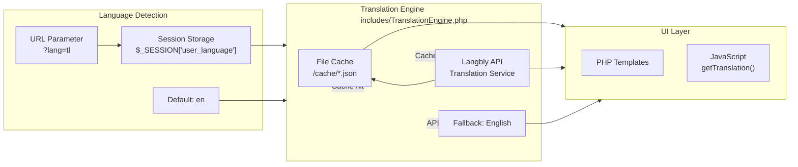

---

## 10. QR Code Integration Architecture

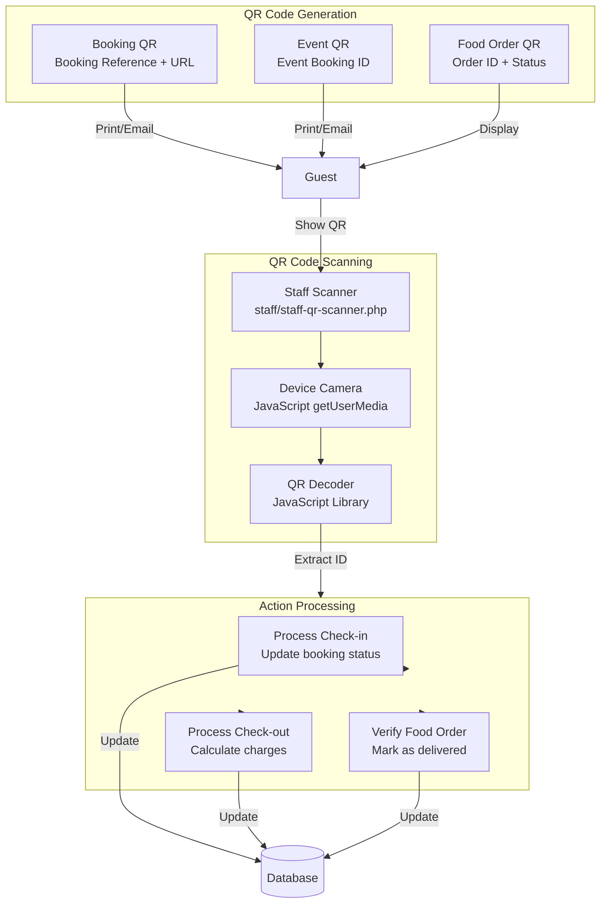

---

## 11. Module Dependencies

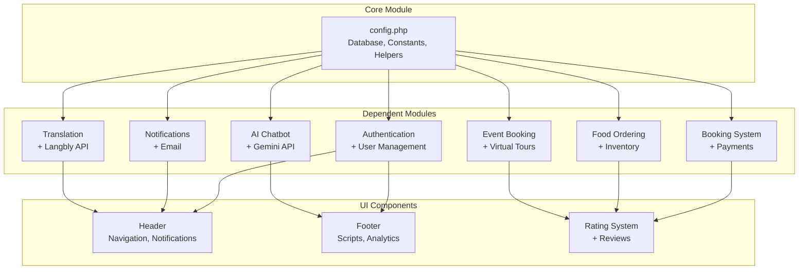

---

## 12. Security Architecture

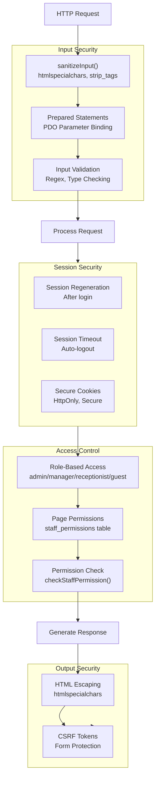

---

## 13. Deployment Architecture

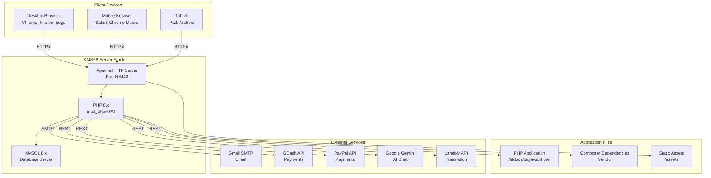

---

## 14. Directory Structure

```
bayawanhotel/
├── 📄 Root Pages (Public)
│   ├── index.php              # Homepage
│   ├── rooms.php              # Room listings
│   ├── room-details.php       # Individual room
│   ├── booking.php            # Booking process
│   ├── dining.php             # Restaurant menu
│   ├── order-now.php          # Food ordering
│   ├── events.php             # Event spaces
│   ├── about.php              # About/Contact
│   ├── gallery.php            # Photo gallery
│   ├── virtual-tour.php       # 360° room tours
│   └── ...
│
├── 🔐 auth/                   # Authentication
│   ├── login.php
│   ├── register.php
│   ├── google-callback.php
│   └── facebook-callback.php
│
├── 👤 user/                   # User Portal
│   ├── dashboard.php
│   ├── my-bookings.php
│   ├── my-food-orders.php
│   ├── my-event-bookings.php
│   ├── notifications.php
│   └── ...
│
├── 👔 staff/                  # Staff Portal
│   ├── staff-dashboard.php
│   ├── checkin.php
│   ├── checkout.php
│   ├── staff-qr-scanner.php
│   ├── walkin-booking.php
│   └── ...
│
├── ⚙️ admin/                  # Admin Portal (44 files)
│   ├── admin-dashboard.php
│   ├── admin-bookings.php
│   ├── admin-users.php
│   ├── admin-reports.php
│   ├── admin-analytics.php
│   └── ...
│
├── 🔌 api/                    # API Endpoints
│   ├── chatbot.php            # AI chat
│   ├── event-payment-process.php
│   ├── ajax-notifications.php
│   ├── calendar-events.php
│   └── submit-rating.php
│
├── 🧩 includes/               # Shared Components
│   ├── config.php             # Core configuration
│   ├── header.php             # Page header
│   ├── footer.php             # Page footer
│   ├── TranslationEngine.php  # i18n support
│   ├── chatbot-component.php  # Chatbot UI
│   ├── notifications.php      # Notification system
│   └── qr_code_helper.php     # QR generation
│
├── 🗄️ database/               # Database
│   └── database.sql           # Schema & seed data
│
├── 💾 cache/                  # Translation cache
│   └── *.json
│
├── 📦 vendor/                 # Composer deps
│   ├── phpmailer/
│   └── endroid/
│
├── 🖼️ assets/                 # Static assets
│   ├── images/
│   ├── css/
│   └── js/
│
└── 📋 logs/                   # Application logs
    └── *.log
```

---

## 15. Summary Statistics

| Metric | Count |
|--------|-------|
| **Total Files** | 150+ PHP files |
| **Database Tables** | 35 tables |
| **Public Pages** | 15 pages |
| **User Portal Pages** | 21 pages |
| **Staff Portal Pages** | 19 pages |
| **Admin Portal Pages** | 44 pages |
| **API Endpoints** | 6 endpoints |
| **External APIs** | 6 services |
| **User Roles** | 4 roles (guest, receptionist, manager, admin) |
| **Composer Packages** | 2 packages |

---

## 16. Key Features

### Core Hotel Management
- ✅ Room booking with availability calendar
- ✅ Online payment (GCash, PayPal, Credit Card, Cash)
- ✅ Check-in/Check-out with QR codes
- ✅ Room service food ordering
- ✅ Event space booking
- ✅ Housekeeping & maintenance tracking

### Guest Features
- ✅ User registration & social login (Google/Facebook)
- ✅ Multi-language support (English + Translation API)
- ✅ AI-powered chatbot (Google Gemini)
- ✅ 360° virtual tours
- ✅ Rating & review system
- ✅ Real-time notifications

### Staff Features
- ✅ QR code scanner for quick check-in/out
- ✅ Walk-in booking capability
- ✅ Food order management
- ✅ Maintenance request tracking
- ✅ Inventory management

### Admin Features
- ✅ Comprehensive analytics dashboard
- ✅ Staff permission management
- ✅ Dynamic content management (slider, gallery, FAQs)
- ✅ Promotional code system
- ✅ Detailed reports & logs

---

*Generated for Bayawan Bai Hotel Management System*
