# Use Case Diagram - Bayawan Bai Hotel Management System

```mermaid
flowchart TB
    subgraph ACTORS["Actors"]
        GUEST["👤 GUEST\n(Customer)"]
        STAFF["👔 STAFF\n(Reception/Manager)"]
        ADMIN["⚙️ ADMIN\n(System Manager)"]
    end

    subgraph SYSTEM["🏨 Hotel Management System Boundary"]
        subgraph GUEST_UC["Guest Use Cases"]
            UC_G1["UC-G1: Register Account"]
            UC_G2["UC-G2: Login"]
            UC_G3["UC-G3: Browse Rooms"]
            UC_G4["UC-G4: Check Room Availability"]
            UC_G5["UC-G5: Book Room"]
            UC_G6["UC-G6: Modify Booking"]
            UC_G7["UC-G7: Cancel Booking"]
            UC_G8["UC-G8: Make Payment"]
            UC_G9["UC-G9: View Booking History"]
            UC_G10["UC-G10: Order Food"]
            UC_G11["UC-G11: Track Order Status"]
            UC_G12["UC-G12: Book Event Space"]
            UC_G13["UC-G13: Cancel Event Booking"]
            UC_G14["UC-G14: Submit Review & Rating"]
            UC_G15["UC-G15: Contact Hotel"]
            UC_G16["UC-G16: Virtual Tour"]
            UC_G17["UC-G17: Subscribe Newsletter"]
            UC_G18["UC-G18: Social Login"]
        end

        subgraph STAFF_UC["Staff Use Cases"]
            UC_S1["UC-S1: Staff Login"]
            UC_S2["UC-S2: Process Walk-in Booking"]
            UC_S3["UC-S3: Check In Guest"]
            UC_S4["UC-S4: Check Out Guest"]
            UC_S5["UC-S5: QR Code Scan"]
            UC_S6["UC-S6: View Booking Details"]
            UC_S7["UC-S7: Modify Booking (Staff)"]
            UC_S8["UC-S8: Cancel Booking (Staff)"]
            UC_S9["UC-S9: Manage Food Orders"]
            UC_S10["UC-S10: Manage Event Bookings"]
            UC_S11["UC-S11: View Reports"]
            UC_S12["UC-S12: Manage Inventory"]
            UC_S13["UC-S13: Maintenance Request"]
            UC_S14["UC-S14: Manage Booking Charges"]
        end

        subgraph ADMIN_UC["Admin Use Cases"]
            UC_A1["UC-A1: Manage Rooms"]
            UC_A2["UC-A2: Configure Pricing"]
            UC_A3["UC-A3: Manage Promotions"]
            UC_A4["UC-A4: Manage Users"]
            UC_A5["UC-A5: Manage Staff Schedules"]
            UC_A6["UC-A6: Manage Inventory (Admin)"]
            UC_A7["UC-A7: Manage Event Spaces"]
            UC_A8["UC-A8: View Analytics"]
            UC_A9["UC-A9: Generate Reports"]
            UC_A10["UC-A10: Configure System"]
            UC_A11["UC-A11: Manage Content"]
            UC_A12["UC-A12: Manage FAQs"]
            UC_A13["UC-A13: Manage Permissions"]
            UC_A14["UC-A14: View Activity Logs"]
            UC_A15["UC-A15: Manage Reviews"]
            UC_A16["UC-A16: Notification Settings"]
        end

        subgraph SYSTEM_UC["System Use Cases (Automated)"]
            UC_SYS1["UC-SYS1: Send Email Notifications"]
            UC_SYS2["UC-SYS2: Send SMS Notifications"]
            UC_SYS3["UC-SYS3: Process Payment Webhook"]
            UC_SYS4["UC-SYS4: Log Activity"]
            UC_SYS5["UC-SYS5: Generate QR Codes"]
            UC_SYS6["UC-SYS6: Chatbot Response"]
            UC_SYS7["UC-SYS7: Check Inventory Levels"]
            UC_SYS8["UC-SYS8: Verify OAuth Identity"]
        end
    end

    subgraph EXTERNAL["External Actors"]
        SUPPLIER["📦 SUPPLIER"]
        PAYMENT["💳 PAYMENT GATEWAY"]
        CHATBOT["🤖 CHATBOT SERVICE"]
        SOCIAL["🔐 SOCIAL PROVIDER"]
    end

    %% Guest connections
    GUEST --> UC_G1
    GUEST --> UC_G2
    GUEST --> UC_G3
    GUEST --> UC_G4
    GUEST --> UC_G5
    GUEST --> UC_G6
    GUEST --> UC_G7
    GUEST --> UC_G8
    GUEST --> UC_G9
    GUEST --> UC_G10
    GUEST --> UC_G11
    GUEST --> UC_G12
    GUEST --> UC_G13
    GUEST --> UC_G14
    GUEST --> UC_G15
    GUEST --> UC_G16
    GUEST --> UC_G17
    GUEST --> UC_G18

    %% Staff connections
    STAFF --> UC_S1
    STAFF --> UC_S2
    STAFF --> UC_S3
    STAFF --> UC_S4
    STAFF --> UC_S5
    STAFF --> UC_S6
    STAFF --> UC_S7
    STAFF --> UC_S8
    STAFF --> UC_S9
    STAFF --> UC_S10
    STAFF --> UC_S11
    STAFF --> UC_S12
    STAFF --> UC_S13
    STAFF --> UC_S14

    %% Admin connections
    ADMIN --> UC_A1
    ADMIN --> UC_A2
    ADMIN --> UC_A3
    ADMIN --> UC_A4
    ADMIN --> UC_A5
    ADMIN --> UC_A6
    ADMIN --> UC_A7
    ADMIN --> UC_A8
    ADMIN --> UC_A9
    ADMIN --> UC_A10
    ADMIN --> UC_A11
    ADMIN --> UC_A12
    ADMIN --> UC_A13
    ADMIN --> UC_A14
    ADMIN --> UC_A15
    ADMIN --> UC_A16

    %% Include relationships (dashed lines)
    UC_G5 -.->|<<include>>| UC_G4
    UC_G5 -.->|<<include>>| UC_G8
    UC_S3 -.->|<<include>>| UC_SYS8
    UC_G10 -.->|<<include>>| UC_G15

    %% Extend relationships (dashed lines with label)
    UC_G6 -.->|<<extend>>| UC_A3
    UC_S4 -.->|<<extend>>| UC_S14

    %% External system connections
    UC_SYS3 --> PAYMENT
    UC_SYS6 --> CHATBOT
    UC_SYS8 --> SOCIAL
    UC_A6 --> SUPPLIER
    UC_S12 --> SUPPLIER

    %% System use case triggers
    UC_G5 --> UC_SYS1
    UC_G5 --> UC_SYS5
    UC_S3 --> UC_SYS4
    UC_G15 --> UC_SYS6
    UC_S12 --> UC_SYS7
```



---

## ASCII Art Alternative (Legacy)

<details>
<summary>View Original ASCII Version</summary>

```
[Original ASCII diagram preserved here...]
```
</details>

---

## Actor Definitions

### **Primary Actors**

| Actor | Description | Primary Goals |
|-------|-------------|---------------|
| **Guest** | Hotel customers and potential guests | Browse rooms, make bookings, order food, book events, submit reviews |
| **Staff** | Receptionists and managers | Manage check-ins/outs, process walk-ins, handle QR scans, manage inventory |
| **Admin** | System administrators and hotel owners | Configure system, manage users, generate reports, control permissions |

### **Secondary/External Actors**

| Actor | Description | Interaction |
|-------|-------------|-------------|
| **Supplier** | External vendors | Receive purchase orders, deliver inventory |
| **Payment Gateway** | GCash, PayPal, Credit Card processors | Process transactions, return confirmations |
| **Chatbot Service** | Gemini AI API | Answer queries, provide recommendations |
| **Social Provider** | Facebook, Google OAuth | Authenticate users, return profile data |

---

## Use Case Descriptions by Actor

### **GUEST Use Cases**

| ID | Use Case | Description | Precondition |
|----|----------|-------------|--------------|
| UC-G1 | **Register Account** | Create new user account with email/password | User not authenticated |
| UC-G2 | **Login** | Authenticate with credentials or OAuth | Account exists |
| UC-G3 | **Browse Rooms** | View room categories, prices, amenities | None |
| UC-G4 | **Check Room Availability** | Search for available rooms by dates | Valid date range provided |
| UC-G5 | **Book Room** | Create room reservation | User authenticated, room available |
| UC-G6 | **Modify Booking** | Change dates, room type, or guest count | Booking exists and is modifiable |
| UC-G7 | **Cancel Booking** | Request cancellation with refund policy | Booking exists and not past check-in |
| UC-G8 | **Make Payment** | Pay via GCash, PayPal, or Credit Card | Booking confirmed, payment pending |
| UC-G9 | **View Booking History** | See past and current reservations | User authenticated |
| UC-G10 | **Order Food** | Place room service or dine-in orders | User authenticated, optional booking |
| UC-G11 | **Track Order Status** | Check food preparation and delivery | Order placed |
| UC-G12 | **Book Event Space** | Reserve venues for meetings/events | Space available |
| UC-G13 | **Cancel Event Booking** | Request event cancellation | Event booking exists |
| UC-G14 | **Submit Review & Rating** | Rate stay, room, dining, or service | Completed booking required |
| UC-G15 | **Contact Hotel** | Send messages via chatbot or email | None |
| UC-G16 | **Virtual Tour** | View 360° room and hotel tours | None |
| UC-G17 | **Subscribe Newsletter** | Join promotional email list | Valid email |
| UC-G18 | **Social Login** | Authenticate via Facebook/Google | OAuth account exists |

### **STAFF Use Cases**

| ID | Use Case | Description | Precondition |
|----|----------|-------------|--------------|
| UC-S1 | **Login** | Staff authentication | Valid staff account |
| UC-S2 | **Process Walk-in Booking** | Create booking for walk-in guests | Room available |
| UC-S3 | **Check In Guest** | Process guest arrival, assign room | Booking confirmed |
| UC-S4 | **Check Out Guest** | Process departure, generate bill | Guest checked in |
| UC-S5 | **QR Code Scan** | Verify bookings/payments via QR | Valid QR code |
| UC-S6 | **View Booking Details** | Access full reservation information | Booking exists |
| UC-S7 | **Modify Booking** | Update booking details for guests | Booking exists |
| UC-S8 | **Cancel Booking** | Process cancellation requests | Booking exists |
| UC-S9 | **Manage Food Orders** | Update order status, mark prepared/delivered | Order exists |
| UC-S10 | **Manage Event Bookings** | Confirm/cancel event reservations | Event inquiry received |
| UC-S11 | **View Reports** | Access daily activity reports | Staff authenticated |
| UC-S12 | **Manage Inventory** | Check stock, process reorders | Staff authenticated |
| UC-S13 | **Maintenance Request** | Report and track room maintenance | Room issue identified |
| UC-S14 | **Manage Booking Charges** | Add incidental charges (minibar, etc.) | Guest checked in |

### **ADMIN Use Cases**

| ID | Use Case | Description | Precondition |
|----|----------|-------------|--------------|
| UC-A1 | **Manage Rooms** | Add/edit room categories, set prices | Admin authenticated |
| UC-A2 | **Configure Pricing** | Set dynamic rates, seasonal pricing | Room categories defined |
| UC-A3 | **Manage Promotions** | Create discount codes, special offers | None |
| UC-A4 | **Manage Users** | Add/edit/delete guest and staff accounts | User account exists |
| UC-A5 | **Manage Staff Schedules** | Assign shifts, approve leave | Staff accounts exist |
| UC-A6 | **Manage Inventory** | Full inventory control, supplier management | Inventory items defined |
| UC-A7 | **Manage Event Spaces** | Configure venues, pricing, availability | Event spaces defined |
| UC-A8 | **View Analytics** | Dashboard metrics, occupancy rates | Data exists in system |
| UC-A9 | **Generate Reports** | Financial, operational, guest reports | Date range selected |
| UC-A10 | **Configure System** | Hotel settings, policies, contact info | Admin access |
| UC-A11 | **Manage Content** | Update gallery, sliders, virtual tours | Media files available |
| UC-A12 | **Manage FAQs** | Add/edit frequently asked questions | None |
| UC-A13 | **Manage Permissions** | Set role-based access control | Roles defined |
| UC-A14 | **View Activity Logs** | Audit user actions and system events | Logging enabled |
| UC-A15 | **Manage Reviews** | Approve/moderate guest reviews | Review submitted |
| UC-A16 | **Notification Settings** | Configure email/SMS templates | SMTP configured |

---

## Include & Extend Relationships

### **<<include>> Relationships** (Required)
| Base Use Case | Included Use Case | Reason |
|---------------|-------------------|--------|
| Book Room | Check Room Availability | Must verify availability first |
| Book Room | Make Payment | Payment required to confirm |
| Check In Guest | Verify Identity | Confirm guest identity |
| Order Food | Browse Menu Categories | Must view menu before ordering |

### **<<extend>> Relationships** (Optional)
| Base Use Case | Extending Use Case | Condition |
|---------------|-------------------|-----------|
| Book Room | Apply Promo Code | If promo code entered |
| Check Out Guest | Apply Late Checkout Fee | If checkout after 12PM |
| Modify Booking | Change Room Type | If different room selected |
| Cancel Booking | Process Refund | If refundable booking |

---

## System Use Cases (Automated)

| ID | Use Case | Trigger | Actor |
|----|----------|---------|-------|
| UC-SYS1 | **Send Email Notifications** | Booking confirmation, reminders, promotions | System |
| UC-SYS2 | **Send SMS Notifications** | Payment confirmations, check-in reminders | System |
| UC-SYS3 | **Process Payment Webhook** | Payment gateway callback | Payment Gateway |
| UC-SYS4 | **Log Activity** | Any user action | System |
| UC-SYS5 | **Generate QR Codes** | Booking confirmation | System |
| UC-SYS6 | **Chatbot Response** | Guest inquiry | Chatbot Service |
| UC-SYS7 | **Check Inventory Levels** | Low stock threshold | System |
| UC-SYS8 | **Verify OAuth Identity** | Social login attempt | Social Provider |

---

## Use Case Dependencies

```
GUEST PRIMARY FLOW:
Register/Login → Browse Rooms → Check Availability → Book Room → Make Payment → Check In → Stay → Check Out → Submit Review

STAFF PRIMARY FLOW:
Login → View Bookings → Check In Guest (or) Process Walk-in → Manage During Stay → Check Out Guest

ADMIN PRIMARY FLOW:
Login → Configure System → Manage Rooms/Users → View Analytics → Generate Reports
```

---

## Use Case to DFD Process Mapping

| Use Case | DFD Process |
|----------|-------------|
| Register/Login | 1.0 User Management |
| Book Room, Check In/Out | 2.0 Room Booking Management |
| Manage Rooms, Users, Reports | 3.0 Admin & Configuration |
| Order Food | 4.0 Food Services |
| Make Payment | 5.0 Payment Processing |
| Book Event Space | 6.0 Event Management |
| Manage Inventory | 7.0 Inventory Management |
| Virtual Tour, Gallery | 8.0 Content Management |
| Contact Hotel (Chatbot) | 9.0 Chatbot Service |
| Send Notifications | 10.0 Notification System |
