# Bayawan Hotel Management System - System Flowchart

This document illustrates the complete system flowchart for the Bayawan Hotel Management System, showing the flow of data and processes across different modules and user roles.

---

## 1. Overall System Flow

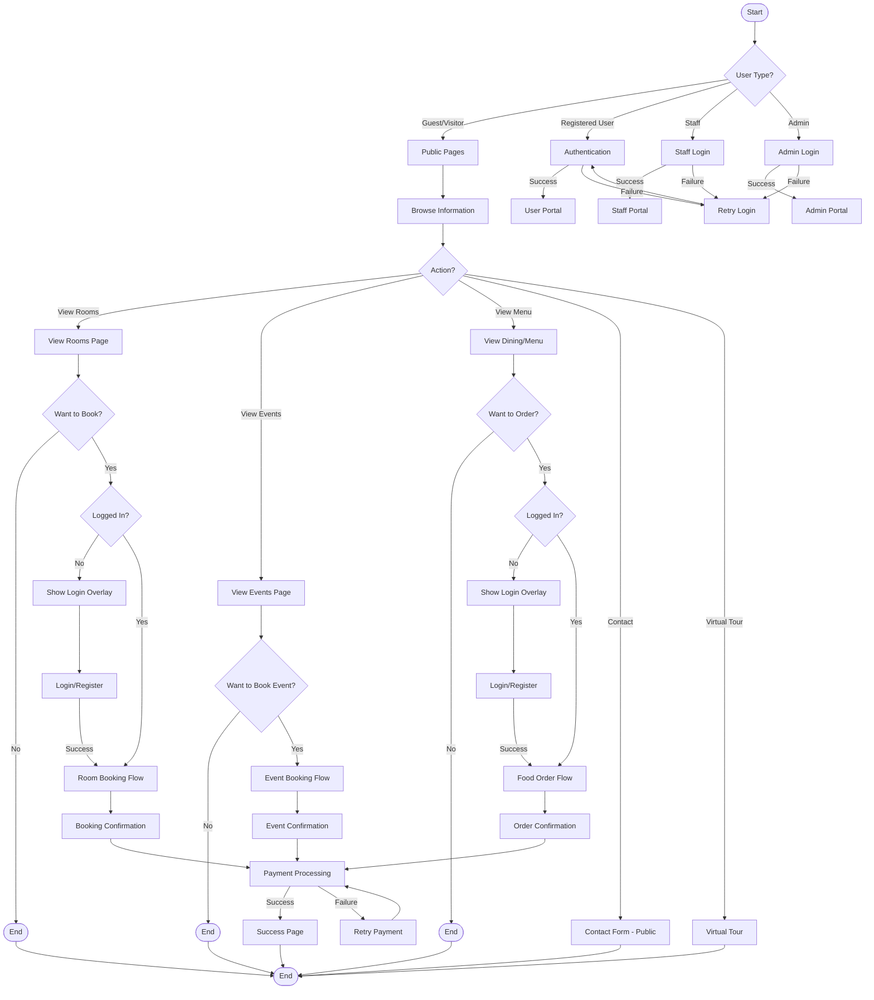

---

## 2. Room Booking Flowchart

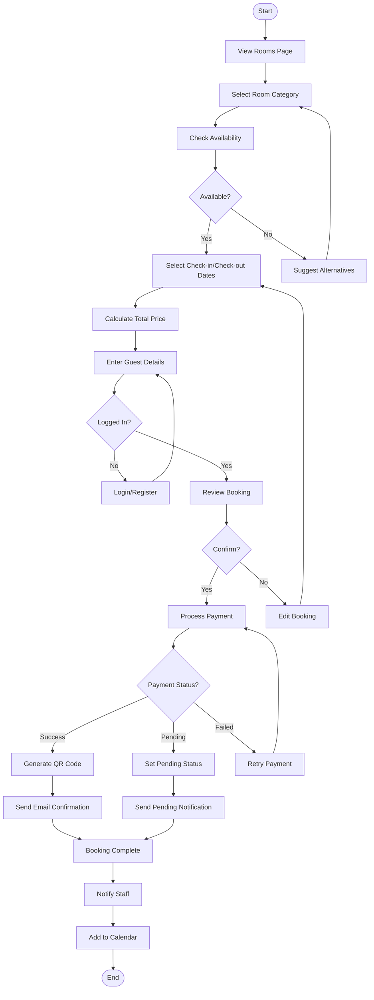

---

## 3. Check-in Process Flowchart

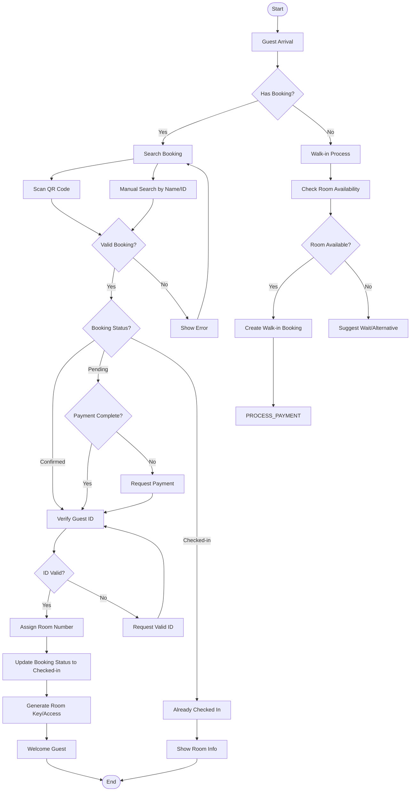

---

## 4. Check-out Process Flowchart

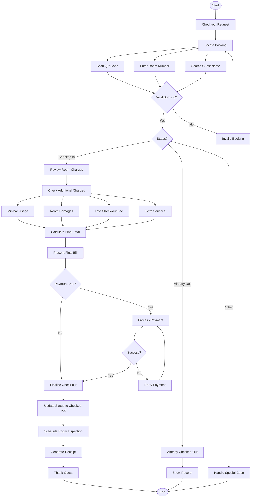

---

## 5. Food Order Process Flowchart

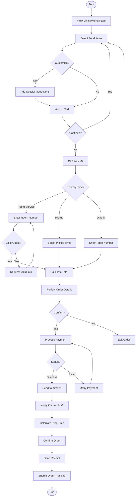

---

## 6. Event Booking Flowchart

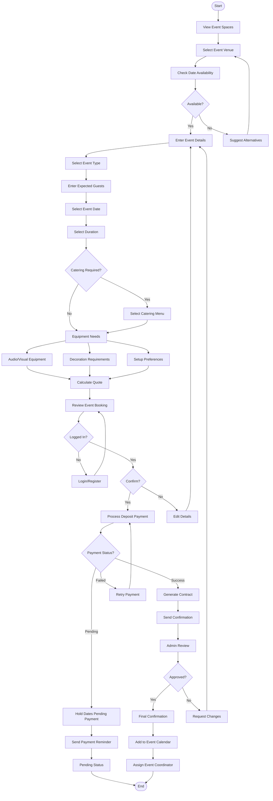

---

## 7. User Registration & Authentication Flowchart

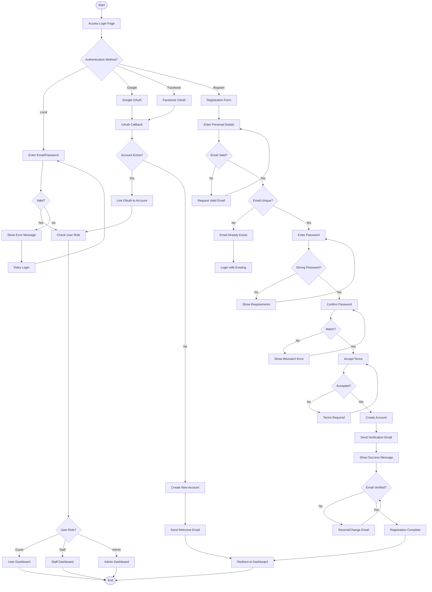

---

## 8. Payment Processing Flowchart

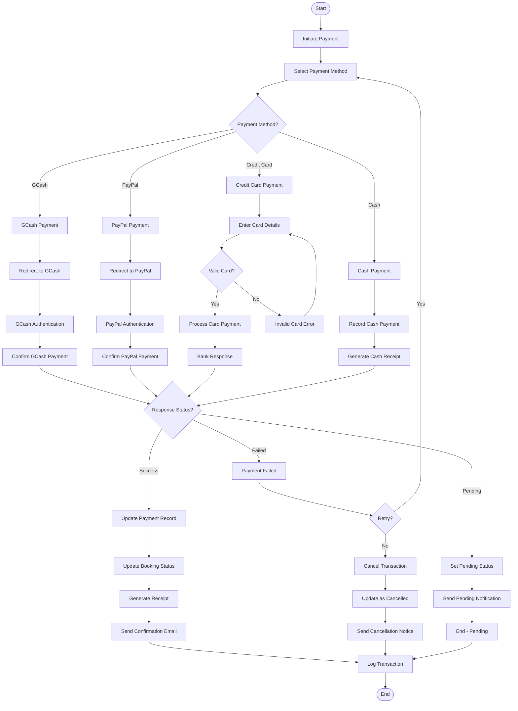

---

## 9. Admin User Management Flowchart

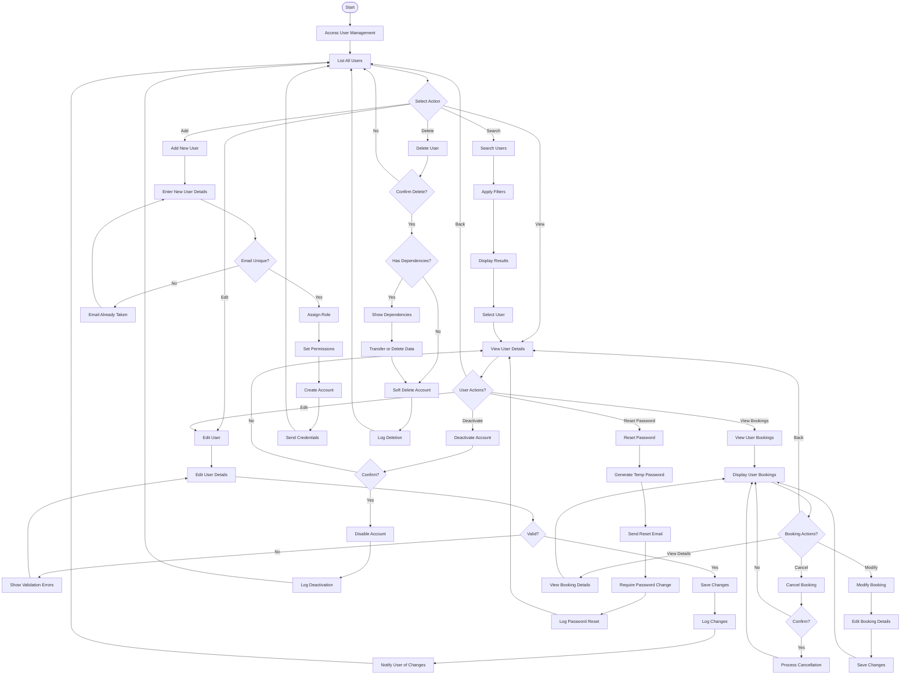

---

## 10. Notification System Flowchart

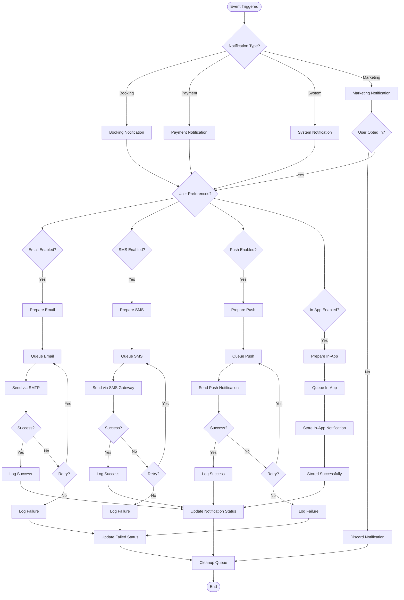

---

## 11. Chatbot Interaction Flowchart

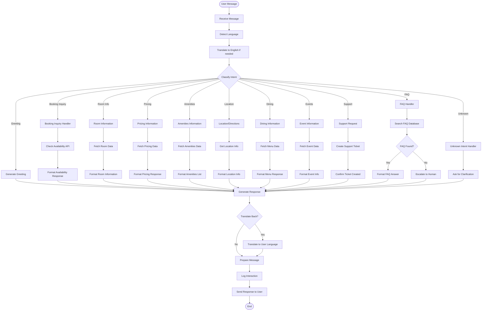

---

## 12. Room Management Flowchart (Admin)

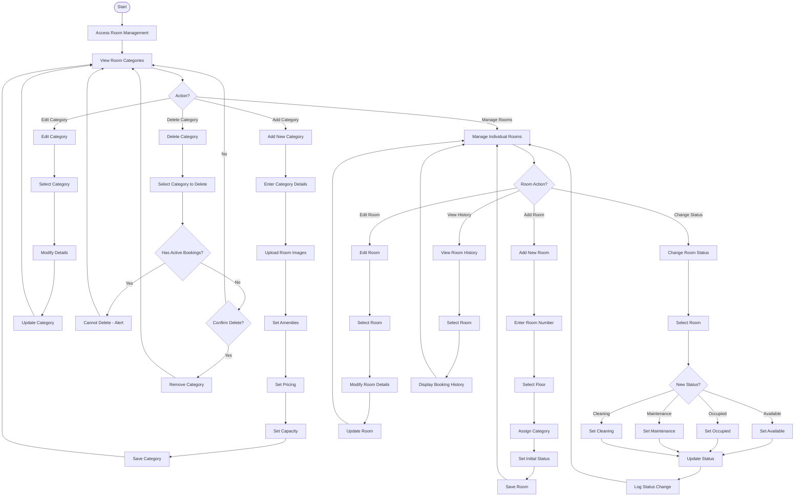

---

## Legend

| Symbol | Meaning |
|--------|---------|
| `([Start])` / `([End])` | Start/End of process |
| `[Process]` | Process or action step |
| `{Decision}` | Decision point with branches |
| `-->|Label|` | Flow direction with condition |

---

## Summary

This System Flowchart document provides comprehensive visual documentation of all major processes in the Bayawan Hotel Management System, including:

- **Overall System Flow**: High-level view of user navigation
- **Room Booking Flow**: Complete reservation process
- **Check-in/Check-out**: Guest arrival and departure workflows
- **Food Ordering**: Room service and dining processes
- **Event Booking**: Event space reservation workflow
- **Authentication**: User registration and login flows
- **Payment Processing**: Multi-gateway payment handling
- **Admin Functions**: User and room management
- **Notification System**: Multi-channel notification delivery
- **Chatbot**: AI-powered guest assistance
- **Room Management**: Administrative room operations
